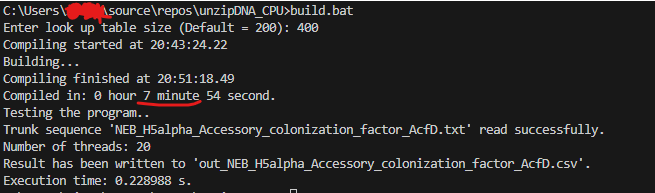
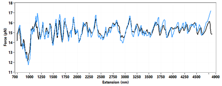

# DNA Unzipping Curve Calculator (CPU version)  

*At the current stage after my optimization, this program is 1,000-2,000 times faster than my proof-of-concept python code.*  

## How to build the project  

The build command should work on Windows and Linux:  

```bash
>g++ -std=c++20 -fconstexpr-ops-limit=100000000000 main.cpp utils.cpp -DJ_SIZE=200 -DEXT_SIZE=200 -o main.exe
```
The lookup table size is controlled by macro **J_SIZE**. The larger the number, the more accurate the result. Increasing this number can significantly increase the compiling time.  
  
For Windows OS, run **build_project.bat** to build with *additional options and testing*. For Linux user, ChatGPT should be able to translate the .bat file to a shell script. If the .bat file is ran successfully, you should see something like this:  
  
The compile time is quite long if the look-up table size is big!  

## Do some tests using the example data

A test sequence is provided (NEB_H5alpha_Accessory_colonization_factor_AcfD). You can run the executable on this example like this:  

```bash
>main.exe NEB_H5alpha_Accessory_colonization_factor_AcfD.txt out.csv
```

The first argument is input file name. The second argument determines the output file name and is optional.  
Run "plot.py" to plot the test sequence's result.  

## Goal of this program  

My goal is to make the unzipping curve calculation very fast in order to calculate the unzipping curves of the whole transcriptome in a reasonable time. There is no better method other than brute-force partition function calculation for now, but I can still move some of the heavy-duty, repetative computation to a lookup table (If the LUT is dense enough, the error is acceptable). Thank to the support of `constexpr` to `std::array` in C++ (C++20 or above), I'm able to calculate and store the lookup table.
  
On Aug/15/2023, I implemented multi-threading. The execution speed increased by another factor of 10-20.  

## DNA unzipping theory  



**Figure above shows DNA unzipping experiment on a 4.4 kb DNA**. Single-molecule measurement (blue) and the theoretically prediced curve (black) agree well.  
  
Further reading on DNA unzipping experiment and theory:  

[1] Essevaz-Roulet, Baptiste, Ulrich Bockelmann, and Francois Heslot. (1997) PNAS  
[2] Bockelmann, Ulrich, et al. (2002) Biophysical journal  
[3] Huguet, Josep M., et al. (2010) PNAS  
